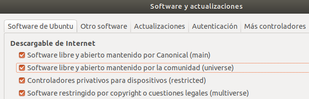

# Robot Submarino UDROBOT
# Guía de Instalación

## 1. Requerimientos del sistema
- Ubuntu Versión 18.04 u otro sistema operativo capaz de soportar ROS Melodic Morenia
- Acceso a internet
- Por lo menos 54 MB de espacio libre para los archivos de UDROBOT, además de lo requerido para ROS Melodic Morenia

## 2. Instalación

### 2.1. ROS Melodic Morenia

#### Configurar los repositorios de ubuntu
Desde la aplicación de ubuntu "Software y actualizaciones", en la ventana "Software de Ubuntu" se deben activar las opciones para Software libre y abierto mantenido por la comunidad (universe), para Controladores privativos para dispositivos (restricted) y para Software restringido por copyright o cuestiones legales (multiverse), tal y como se muestra en la siguiente imagen.

[]

### 2.2. Rviz

### 2.3. Repositorio Robot Submarino UDROBOT
